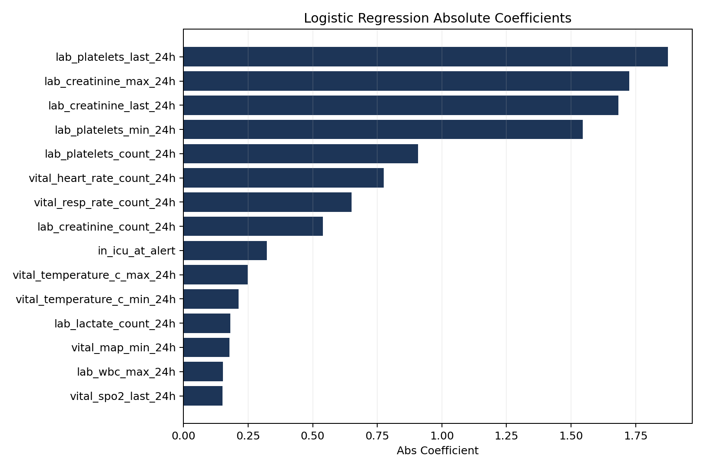
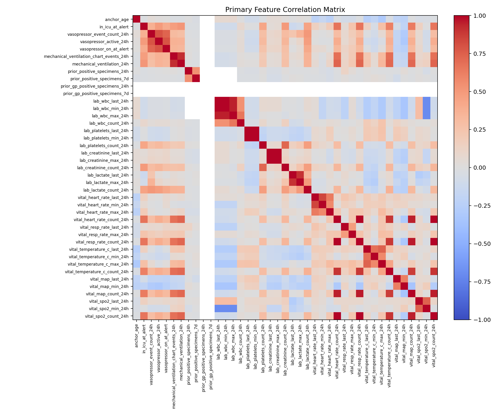

# Primary Baseline Explainability

## Why This File Exists

This file explains the **41-feature first-alert baseline** in a way that is easy to review.

It focuses on:

- dataset size
- clinical meaning of the task
- SHAP-style feature importance for XGBoost
- logistic-regression coefficient ranking
- feature correlation patterns
- what to improve next in the ML pipeline

## Clinical Task

The prediction target is:

- one row = the **first Gram-positive blood-culture alert** in one admission
- output = whether that alert is more likely:
  - `probable_clinically_significant_bsi_alert`
  - or `probable_contaminant_or_low_significance_alert`

This is clinically meaningful because it matches a real review question:

- does this first alert look important enough to prioritize as a likely true bloodstream infection signal?

## Dataset Snapshot

Full first-alert dataset:

- rows: `5,546`
- unique patients: `5,021`
- unique admissions: `5,546`

High-confidence binary subset used for the 41-feature baseline:

- rows: `2,506`
- unique patients: `2,369`
- unique admissions: `2,506`
- positives: `1,246`
- negatives: `1,260`

This means the main model is trained on a balanced, clinically interpretable first-alert cohort.

## Main Baseline Performance

Held-out test performance:

- Logistic Regression: AUROC `0.798`, F1 `0.767`
- XGBoost: AUROC `0.809`, F1 `0.761`

Interpretation:

- the 41-feature baseline has useful signal
- performance is moderate rather than inflated
- this is a more defensible baseline than the larger exploratory feature set

## Top XGBoost SHAP Features

The XGBoost model was explained using Tree SHAP contributions from `pred_contribs`.

Top features by mean absolute SHAP value:

1. `lab_platelets_last_24h`
2. `lab_creatinine_last_24h`
3. `lab_platelets_min_24h`
4. `anchor_age`
5. `lab_creatinine_max_24h`
6. `lab_platelets_count_24h`
7. `in_icu_at_alert`
8. `vital_temperature_c_max_24h`
9. `vital_temperature_c_min_24h`
10. `lab_creatinine_count_24h`

Plain reading:

- platelet pattern is the strongest signal in this compact model
- creatinine pattern is also very important
- age and ICU status matter
- temperature contributes more than some other vital summaries

Files:

- [reports/blood_culture_primary_xgb_shap_importance.csv](reports/blood_culture_primary_xgb_shap_importance.csv)
- [reports/blood_culture_primary_xgb_shap_importance.png](reports/blood_culture_primary_xgb_shap_importance.png)

Figure:

## Logistic Regression Feature Ranking

Top features by absolute logistic coefficient:

1. `lab_platelets_last_24h`
2. `lab_creatinine_max_24h`
3. `lab_creatinine_last_24h`
4. `lab_platelets_min_24h`
5. `lab_platelets_count_24h`
6. `vital_heart_rate_count_24h`
7. `vital_resp_rate_count_24h`
8. `lab_creatinine_count_24h`
9. `in_icu_at_alert`
10. `vital_temperature_c_max_24h`

Important caution:

- coefficient direction is harder to interpret when several near-duplicate summaries are present
- absolute ranking is more stable than raw sign here

Files:

- [reports/blood_culture_primary_logistic_coefficients.csv](reports/blood_culture_primary_logistic_coefficients.csv)
- [reports/blood_culture_primary_logistic_coefficients.png](reports/blood_culture_primary_logistic_coefficients.png)

Figure:

## Correlation Findings

The strongest correlations are not surprising. They mainly show feature redundancy inside the compact set.

Examples:

1. `lab_wbc_last_24h` vs `lab_wbc_min_24h`: `0.999998`
2. `lab_platelets_last_24h` vs `lab_platelets_min_24h`: `0.998376`
3. `lab_creatinine_last_24h` vs `lab_creatinine_max_24h`: `0.996480`
4. `vital_heart_rate_count_24h` vs `vital_spo2_count_24h`: `0.995516`
5. `vital_heart_rate_count_24h` vs `vital_resp_rate_count_24h`: `0.992189`

Interpretation:

- several `last/min/max` pairs are almost duplicates in practice
- the various vital-sign `count` columns behave like a shared observation-intensity signal
- this helps explain why simple models already perform reasonably well

Files:

- [reports/blood_culture_primary_feature_correlation_pairs.csv](reports/blood_culture_primary_feature_correlation_pairs.csv)
- [reports/blood_culture_primary_feature_correlation_matrix.csv](reports/blood_culture_primary_feature_correlation_matrix.csv)
- [reports/blood_culture_primary_feature_correlation.png](reports/blood_culture_primary_feature_correlation.png)

Figure:

## What This Suggests For A Stronger ML Pipeline

The next stronger pipeline should probably do four things:

1. Keep the 41-feature model as the clean baseline.
2. Build a pruned version that removes the most redundant summary pairs.
3. Keep XGBoost and Logistic Regression together, because they give complementary views:
   - XGBoost for nonlinear ranking performance
   - Logistic Regression for simpler interpretability
4. Add calibration and subgroup analysis before adding architectural complexity.

Good next comparison:

- baseline A: current 41-feature model
- baseline B: pruned low-redundancy model
- baseline C: expanded but still safe pre-alert model

That would give a clearer paper story than jumping straight to a more complex architecture.
