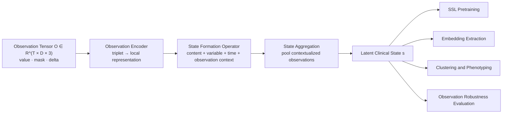
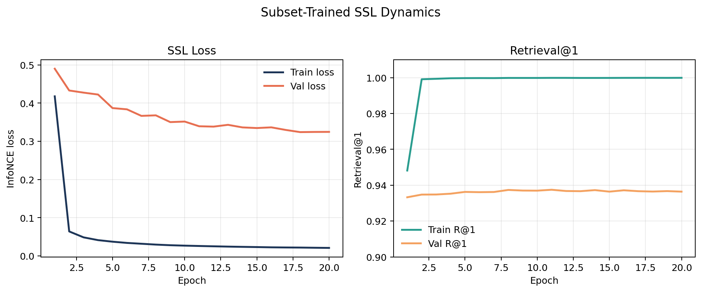
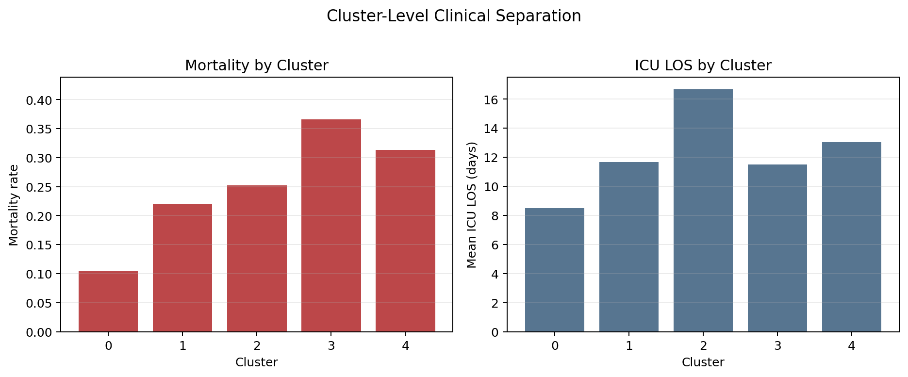
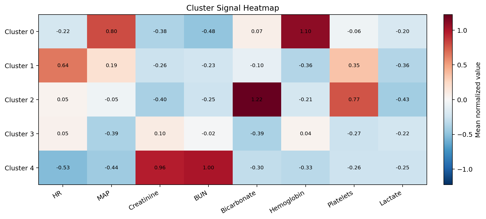
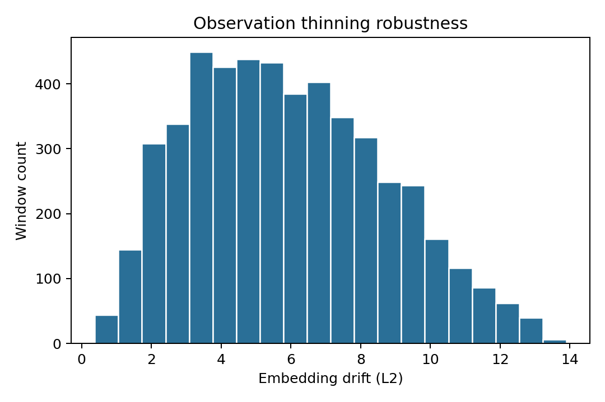

# Information State

[](https://github.com/Y-Haoran/information_state/releases)
[](LICENSE)


**State-from-Observation** is a representation-learning framework for ICU EHR that treats clinical data as an **observation tensor** rather than a flat time series. The repository is deliberately narrow: it exists to build the observation field, learn latent clinical state with self-supervision, cluster those states into candidate phenotypes, and test whether the learned representation is robust to changes in the observation process.

> Clinical state is not directly observed. It is inferred from a stream of irregular observations, each carrying different amounts of information.

## Overview

At each time step `t` and variable `d`, the model consumes an observation triplet:

```text
o(t, d) = [value, mask, delta]
```

where:

- `value` is the normalized and forward-filled measurement
- `mask` indicates whether the variable was actually observed at that time
- `delta` is the time since the last true observation

Instead of treating missingness as a nuisance after the fact, the model treats the observation process as part of the signal.



## What This Repository Contains

| Area | Purpose |
| --- | --- |
| `information_state/config.py` | Project configuration, curated feature definitions, artifact paths |
| `information_state/feature_catalog.py` | Resolution of curated variables against MIMIC-IV dictionaries |
| `information_state/observation_data.py` | Cohort construction, hourly tensor building, sliding windows, dataset classes |
| `information_state/state_from_observation.py` | Observation encoder, state formation operator, encoder model |
| `information_state/contrastive.py` | Symmetric InfoNCE objective |
| `information_state/train_ssl.py` | Self-supervised training entrypoint |
| `information_state/extract_embeddings.py` | Window-level embedding export using `model.encode()` |
| `information_state/cluster_states.py` | KMeans clustering of latent state windows |
| `information_state/evaluate_phenotypes.py` | Outcome, physiology, and transition summaries by cluster |
| `information_state/evaluate_aki_phenotypes.py` | AKI-specific renal trajectory and KDIGO phenotype summaries |
| `information_state/evaluate_observation_robustness.py` | Embedding drift under observation thinning |
| `tests/` | Scientific-integrity and end-to-end synthetic smoke tests |
| `notebooks/01_state_from_observation_demo.ipynb` | Data-free conceptual demo of the core mechanism |

## Design Principles

- **Observation-first**: the repo models what was measured, when it was measured, and how stale unmeasured values are.
- **Narrow scope**: no unrelated baselines, classifiers, or treatment-policy tasks are mixed into this codebase.
- **Reproducible artifacts**: each stage writes a `run_config.json` plus timestamped manifests with git and dataset provenance.
- **Stress the claim directly**: robustness to observation thinning is treated as a first-class evaluation, not an afterthought.

## Quick Start

### 1. Install

Lightweight environment:

```bash
python3 -m pip install -r requirements.txt
python3 -m pip install -e .
```

Pinned environment matching the current bounded run:

```bash
python3 -m pip install -r requirements-lock.txt
python3 -m pip install -e .
```

### 2. Run the Synthetic Smoke Test

This does not require MIMIC-IV access and is the fastest way to verify that the full pipeline works:

```bash
python3 -m unittest discover -s tests
```

### 3. Train on MIMIC-IV

```bash
python3 -m information_state.train_ssl \
  --raw-root /path/to/mimic-iv \
  --cohort all_adult_icu \
  --build-data \
  --window-hours 24 \
  --window-stride-hours 2 \
  --positive-window-gap-hours 2 \
  --epochs 50 \
  --batch-size 32 \
  --seed 7
```

Then run the downstream stages:

```bash
python3 -m information_state.extract_embeddings --cohort all_adult_icu --split train val --seed 7
python3 -m information_state.cluster_states --cohort all_adult_icu --split train --k 4 --seed 7
python3 -m information_state.evaluate_phenotypes --cohort all_adult_icu
python3 -m information_state.evaluate_observation_robustness --cohort all_adult_icu --split val --seed 7
```

After editable install, the same workflow is also exposed as console scripts:

- `information-state-train`
- `information-state-extract`
- `information-state-cluster`
- `information-state-evaluate`
- `information-state-evaluate-aki`
- `information-state-robustness`

### 4. Run the AKI-Specific Cohort

The repo now supports an AKI-only cohort path via `--cohort aki_kdigo`. This keeps the model unchanged and only changes the stay selection plus downstream artifacts.

Current AKI cohort builder:

- uses KDIGO-style serum-creatinine criteria
- adds urine-output criteria when stay-level weight can be resolved from ICU charted weights
- writes AKI onset/stage fields into both `cohort.csv` and `window_metadata.csv`
- stores AKI artifacts separately under `artifacts/state_from_observation/aki_kdigo/`

Example:

```bash
python3 -m information_state.train_ssl \
  --raw-root /path/to/mimic-iv \
  --cohort aki_kdigo \
  --build-data \
  --epochs 20 \
  --batch-size 32 \
  --seed 7

python3 -m information_state.extract_embeddings --cohort aki_kdigo --split train val test --seed 7
python3 -m information_state.cluster_states --cohort aki_kdigo --split train --k 3 4 5 --seed 7
python3 -m information_state.evaluate_phenotypes --cohort aki_kdigo
python3 -m information_state.evaluate_aki_phenotypes --cohort aki_kdigo
```

## Expected Outputs

The default artifact root is:

```text
artifacts/state_from_observation/
```

For non-default cohorts, artifacts are namespaced under that root. Example:

```text
artifacts/state_from_observation/aki_kdigo/
```

A complete run produces outputs like:

```text
artifacts/state_from_observation/
  cohort.csv
  feature_stats.json
  hourly_metadata.json
  hourly_values.npy
  hourly_masks.npy
  hourly_deltas.npy
  state_from_observation_ssl.pt
  ssl_history.json
  run_config.json
  window_metadata.csv
  manifests/
  embeddings/
  clusters/
  evaluation/
  robustness/
```

Stage-specific outputs:

| Stage | Key outputs |
| --- | --- |
| Training | `state_from_observation_ssl.pt`, `ssl_history.json`, `run_config.json` |
| Embeddings | `train_embeddings.npy`, `val_embeddings.npy`, `embedding_manifest.json` |
| Clustering | `cluster_assignments.csv`, `cluster_model.npz`, `cluster_summary.json` |
| Phenotype evaluation | `cluster_outcomes.csv`, `cluster_feature_profiles.csv`, `evaluation_report.md` |
| Robustness | `robustness_metrics.csv`, `robustness_summary.json`, `embedding_drift_histogram.png` |

## Current Performance Snapshot

The repository now includes a **current subset-trained real-data run** built on the full MIMIC-IV observation corpus, with training performed on sampled positive pairs and downstream analysis performed on sampled windows. This is a much stronger proof point than the earlier 16-patient smoke run, while still stopping short of a final paper-grade benchmark campaign.

### Built Corpus

The observation-field build used the full resolved cohort artifacts:

| Item | Value |
| --- | ---: |
| data source | MIMIC-IV v3.1 |
| adult ICU stays in built corpus | `74,829` |
| hourly bins | `7,865,407` |
| windows | `3,091,082` |
| positive windows | `3,016,253` |
| dynamic variables | `22` |

### Current Training Run

The finished training checkpoint comes from a train-only subset run over those full-build artifacts:

| Item | Value |
| --- | --- |
| time bin | `1h` |
| window length | `24h` |
| window stride | `2h` |
| positive pair gap | `2h` |
| delta cap | `48h` |
| sampled train pairs | `200,000` |
| sampled val pairs | `20,000` |
| model width | `d_model = 128` |
| attention heads | `4` |
| layers | `3` |
| projection dim | `128` |
| epochs | `20` |
| training device | `Tesla V100-SXM2-16GB` |
| training runtime | about `3.1h` |

### Optimization Metrics

The SSL objective behaved stably across the full 20-epoch run.

| Metric | Train | Val |
| --- | ---: | ---: |
| final InfoNCE loss | `0.0210` | `0.3247` |
| final Retrieval@1 | `0.9999` | `0.9364` |
| final positive cosine | `0.9192` | `0.9913` |
| best val loss | epoch `18`, `0.3241` |  |
| best val Retrieval@1 | epoch `11`, `0.9375` |  |

Interpretation:

- the optimization curve is healthy and monotonic
- validation loss continued to improve late into training
- train retrieval saturated early, so the current positive-pair task is likely somewhat easy on this subset

Current training dynamics:



### Sampled Downstream Evaluation

To keep downstream analysis tractable and honest, the current representation results are reported on sampled windows rather than all `3.09M` windows:

| Split | Windows | Embedding shape |
| --- | ---: | --- |
| train sample for embeddings | `50,000` | `(50000, 128)` |
| clustering sample from train embeddings | `5,000` | `(5000, 128)` |
| val sample | `5,000` | `(5000, 128)` |
| test sample | `5,000` | `(5000, 128)` |

### Clustering Metrics

KMeans was run on a randomized `5,000`-window train embedding sample.

| k | Silhouette | Davies-Bouldin | Cluster sizes |
| --- | ---: | ---: | --- |
| `3` | `0.1044` | `2.6063` | `1977, 1407, 1616` |
| `4` | `0.1127` | `2.3267` | `1229, 1475, 1156, 1140` |
| `5` | `0.1152` | `2.2106` | `973, 929, 1123, 1050, 925` |
| `6` | `0.1107` | `2.1452` | `847, 830, 968, 944, 644, 767` |

The selected clustering was `k = 5` by silhouette score.

Interpretation:

- geometric separation is present but not yet strong
- the current clusters are better read as exploratory latent states than final phenotype claims

### Phenotype-Level Clinical Separation

Even with modest geometric separation, the latent states show clinically different outcome profiles on the sampled train windows:

| Cluster | Windows | Stays | Mortality | ICU LOS mean |
| --- | ---: | ---: | ---: | ---: |
| `0` | `973` | `308` | `0.105` | `8.51` |
| `1` | `929` | `265` | `0.221` | `11.68` |
| `2` | `1123` | `222` | `0.252` | `16.68` |
| `3` | `1050` | `319` | `0.366` | `11.52` |
| `4` | `925` | `243` | `0.314` | `13.03` |

Examples from the generated phenotype report:

- Cluster `0`: lower mortality, relatively higher blood pressure signal
- Cluster `3`: highest mortality, lower `SBP/DBP/MAP` and lower bicarbonate
- Cluster `4`: renal-heavy pattern with high `BUN` and `creatinine`

Current cluster-level outcome separation:



Current latent-state signal heatmap:



### Observation Robustness

Validation windows were perturbed by random observation thinning with drop probability `0.3`, evaluated on `5,000` validation windows.

| Metric | Value |
| --- | ---: |
| windows evaluated | `5,000` |
| mean embedding drift (L2) | `5.9184` |
| median embedding drift (L2) | `5.6726` |
| mean embedding cosine | `0.8237` |
| cluster stability rate | `0.7294` |

Interpretation:

- the current encoder is **not** invariant to observation perturbation
- this is scientifically useful: it shows the repo is now reporting a realistic robustness number rather than an artifact of a tiny smoke run
- observation robustness remains an open target for improvement

Current robustness output from this run:



### Current Artifact References

The current run writes the full metric trail needed to audit these numbers:

- `artifacts/state_from_observation/ssl_history.json`
- `artifacts/state_from_observation/embeddings/train_embeddings.npy`
- `artifacts/state_from_observation/embeddings/val_embeddings.npy`
- `artifacts/state_from_observation/clusters/cluster_summary.json`
- `artifacts/state_from_observation/evaluation/cluster_outcomes.csv`
- `artifacts/state_from_observation/evaluation/evaluation_report.md`
- `artifacts/state_from_observation/robustness/robustness_summary.json`
- `artifacts/state_from_observation/robustness/embedding_drift_histogram.png`
- `scripts/make_readme_figures.py`

## Reproducibility

Every major stage writes:

- a stage-local `run_config.json`
- a timestamped manifest under `artifacts/state_from_observation/manifests/`

Those manifests include:

- CLI arguments
- serialized project configuration
- git commit and dirty-state status
- runtime context
- dataset artifact hashes
- output artifact paths

This makes it possible to answer, for any checkpoint or downstream result:

- which code version produced it
- which observation dataset artifacts were used
- which window length, stride, and positive-pair gap were active
- which random seed and runtime settings were used

## Testing and Demo

The repo includes targeted checks for the scientific contract, not just generic unit tests.

Covered behaviors:

- observation tensor shape and binary mask semantics
- delta reset and capping logic
- positive-window gap construction
- model behavior on missing-heavy batches
- full synthetic `train → extract → cluster → evaluate → robustness` smoke run

Run validation locally:

```bash
python3 -m py_compile information_state/*.py
python3 -m unittest discover -s tests
```

For a protected-data-free walkthrough of the central idea:

- [notebooks/01_state_from_observation_demo.ipynb](notebooks/01_state_from_observation_demo.ipynb)

## What This Repo Does Not Try to Do

This repository does **not** include:

- earlier blood-culture classifiers
- broad benchmark collections unrelated to the state-formation claim
- target trial emulation
- treatment-effect modeling
- downstream tasks that would dilute the core method story

That restriction is intentional. The repository is meant to read as one coherent research software project rather than a mixed lab dump.

## Project Status

This repo is in a strong **research software** state:

- the end-to-end pipeline exists
- synthetic, bounded, and subset-full-cohort real-data runs are working
- the GitHub release, citation, license, and contribution metadata are in place

What still belongs to future work rather than README overclaim:

- large-scale full-corpus experiments
- final baseline comparison tables
- paper-grade figures and final statistical analysis

## Citation

If you use this repository, please cite the software metadata and the accompanying manuscript draft:

- [CITATION.cff](CITATION.cff)
- [NATURE_STYLE_MANUSCRIPT_DRAFT.md](NATURE_STYLE_MANUSCRIPT_DRAFT.md)

## Repository Metadata

- license: [LICENSE](LICENSE)
- contribution guide: [CONTRIBUTING.md](CONTRIBUTING.md)
- change history: [CHANGELOG.md](CHANGELOG.md)
- release page: <https://github.com/Y-Haoran/information_state/releases>
