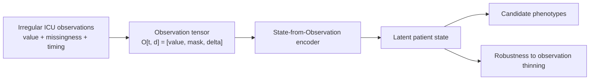
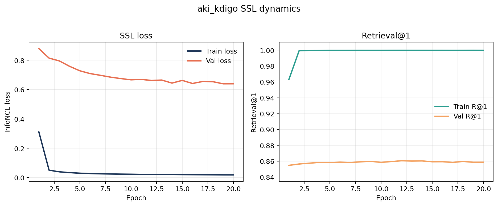
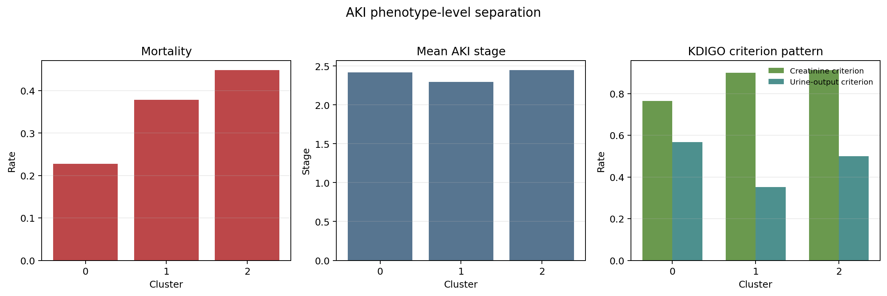
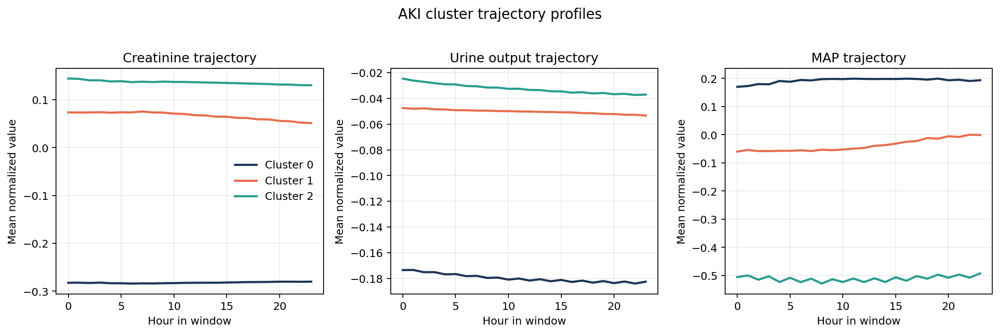
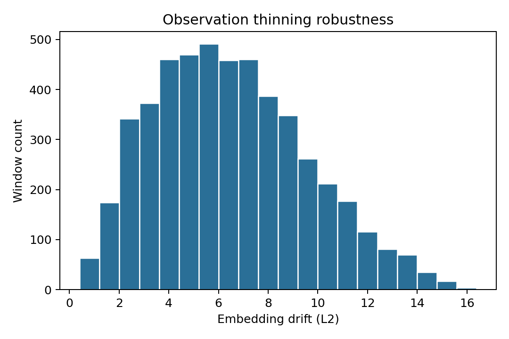
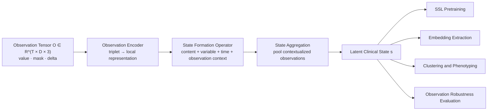
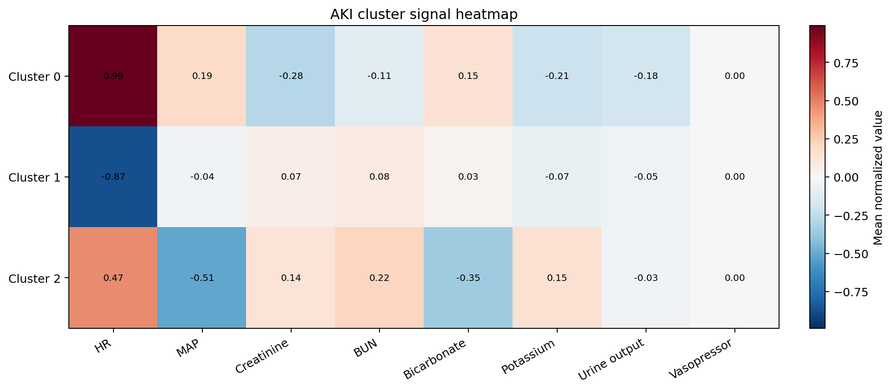

# Information State

[](https://github.com/Y-Haoran/information_state/releases)
[](LICENSE)


**State-from-Observation** is a research framework for learning patient state from irregular ICU measurements. Instead of flattening ICU data into an imputed time series, the method models three things jointly for every clinical variable and hour: the current value, whether it was truly observed, and how long it has been since the last observation.

ICU data is not only incomplete; the observation process itself often carries signal. A variable may be missing because it was not clinically needed, while repeated measurements may reflect rising concern. This repository studies whether patient state can be learned from that observation process and then used for exploratory phenotype discovery, starting with AKI.

> Clinical state is not directly observed. It is inferred from a stream of irregular observations, each carrying different amounts of information.



## Why This Matters

Most ICU models treat missingness as noise to be repaired before learning begins. This repo takes a different view: observation patterns are part of the phenotype. That makes the project useful for questions where the timing and density of measurements matter, such as renal deterioration, hemodynamic instability, and syndrome subtyping.

## What This Repo Does Right Now

This repo currently supports an end-to-end exploratory pipeline for:

- building observation-based ICU tensors from MIMIC-IV
- training a self-supervised State-from-Observation encoder
- extracting window-level latent state embeddings
- clustering those embeddings into candidate phenotypes
- evaluating whether those groups are clinically different
- testing whether learned states remain stable under observation thinning

## Current Takeaway

The current AKI pilot suggests that the method can recover clinically different **candidate** patient states from ICU measurement history. Those states differ in mortality and renal/hemodynamic signal profile, and they remain fairly stable under random observation thinning.

At the same time, the current results should still be read as **exploratory candidate phenotypes**, not final validated clinical subtypes.

| Question | Current answer |
| --- | --- |
| Can the model train stably on large MIMIC-IV builds? | Yes. |
| Does the AKI pilot produce candidate phenotype structure? | Yes. |
| Are these final validated clinical subtypes? | No. |
| Is there a direct baseline comparison table yet? | No. |

## AKI Pilot At A Glance

The most complete current run is a full `aki_kdigo` end-to-end pilot:

- `32,168` AKI ICU stays
- `2,101,754` AKI windows
- `20` training epochs
- `10,000` clustered train embeddings
- `5,000` robustness-evaluated validation windows

<p align="center">
  
  
</p>
<p align="center">
  
  
</p>

These figures show four different parts of the current story:

- training is stable over the AKI pilot run
- clusters separate meaningfully in mortality and KDIGO criterion pattern
- clusters differ in creatinine, urine output, and MAP trajectory profile
- embeddings remain moderately stable under observation thinning

## What This Repo Is Not Claiming Yet

This repo does **not** yet claim:

- final validated AKI subtypes
- treatment-sensitive phenotypes
- superiority over baseline models without direct comparison tables
- external validation across hospitals or datasets

That boundary is intentional. The current repo is a serious phenotype-discovery and method-validation codebase, not a finished clinical decision system.

## Baseline Strategy

For a first paper-quality comparison, the most reasonable baselines are:

- **XGBoost or Random Forest on window summaries**: a strong tabular baseline using aggregated features from each window, such as means, extrema, slopes, mask density, and delta statistics.
- **Flat sequence baseline**: a GRU or Transformer trained on the same `value / mask / delta` windows but without the observation-aware state formation operator.

The important distinction is:

- XGBoost or Random Forest is a good baseline for showing that simple supervised structure can be extracted from summarized windows.
- A flat GRU or Transformer is the more direct architectural baseline for the core scientific claim.

So yes, `XGBoost` and `RandomForest` are reasonable and useful baselines, but they should complement, not replace, a flat time-series neural baseline.

## Quick Start

### Install

Lightweight environment:

```bash
python3 -m pip install -r requirements.txt
python3 -m pip install -e .
```

Pinned environment matching the current tracked runs:

```bash
python3 -m pip install -r requirements-lock.txt
python3 -m pip install -e .
```

### Run The Synthetic Smoke Test

This does not require MIMIC-IV access.

```bash
python3 -m unittest discover -s tests
```

### Train On MIMIC-IV

General adult ICU cohort:

```bash
python3 -m information_state.train_ssl \
  --raw-root /path/to/mimic-iv \
  --cohort all_adult_icu \
  --build-data \
  --window-hours 24 \
  --window-stride-hours 2 \
  --positive-window-gap-hours 2 \
  --epochs 50 \
  --batch-size 32 \
  --seed 7
```

AKI-specific cohort:

```bash
python3 -m information_state.train_ssl \
  --raw-root /path/to/mimic-iv \
  --cohort aki_kdigo \
  --build-data \
  --epochs 20 \
  --batch-size 32 \
  --seed 7

python3 -m information_state.extract_embeddings --cohort aki_kdigo --split train val test --seed 7
python3 -m information_state.cluster_states --cohort aki_kdigo --split train --k 3 4 5 --seed 7
python3 -m information_state.evaluate_phenotypes --cohort aki_kdigo
python3 -m information_state.evaluate_aki_phenotypes --cohort aki_kdigo
python3 -m information_state.evaluate_observation_robustness --cohort aki_kdigo --split val --seed 7
```

After editable install, the same workflow is also exposed as console scripts:

- `information-state-train`
- `information-state-extract`
- `information-state-cluster`
- `information-state-evaluate`
- `information-state-evaluate-aki`
- `information-state-robustness`

## Method Overview

At each time step `t` and variable `d`, the model consumes an observation triplet:

```text
o(t, d) = [value, mask, delta]
```

where:

- `value` is the normalized and forward-filled measurement
- `mask` indicates whether the variable was actually observed at that time
- `delta` is the time since the last true observation

The model then forms patient state from those triplets rather than from a flat tokenized or imputed series.



## Current Results

### AKI KDIGO End-to-End Pilot

This is the strongest current syndrome-specific result in the repo.

#### AKI Cohort Scale

| Item | Value |
| --- | ---: |
| AKI stays | `32,168` |
| AKI windows | `2,101,754` |
| variables | `22` |
| window length | `24h` |
| window stride | `2h` |

#### Training Snapshot

This pilot used sampled positive pairs for tractable GPU training.

| Item | Value |
| --- | --- |
| sampled train pairs | `300,000` |
| sampled val pairs | `30,000` |
| model width | `d_model = 128` |
| attention heads | `4` |
| layers | `3` |
| epochs | `20` |
| training device | `Tesla V100-SXM2-16GB` |

Final optimization metrics:

| Metric | Value |
| --- | ---: |
| best val loss | epoch `19`, `0.6397` |
| best val Retrieval@1 | epoch `12`, `0.8606` |
| final val loss | `0.6399` |
| final val Retrieval@1 | `0.8588` |

Exported embeddings:

| Split | Shape |
| --- | --- |
| train | `(10000, 128)` |
| val | `(5000, 128)` |
| test | `(5000, 128)` |

#### AKI Clustering Snapshot

KMeans was run on the `10,000` train-window embedding sample.

| k | Silhouette | Davies-Bouldin | Cluster sizes |
| --- | ---: | ---: | --- |
| `3` | `0.1176` | `2.4619` | `3617, 2752, 3631` |
| `4` | `0.1139` | `2.2807` | `2289, 2488, 2456, 2767` |
| `5` | `0.1153` | `2.1989` | `2065, 2038, 1742, 2056, 2099` |

The selected clustering was `k = 3` by silhouette score.

AKI cluster-level outcomes:

| Cluster | Windows | Stays | Mortality | Mean AKI stage | Creatinine criterion | Urine-output criterion |
| --- | ---: | ---: | ---: | ---: | ---: | ---: |
| `0` | `3617` | `80` | `0.227` | `2.42` | `0.765` | `0.568` |
| `1` | `2752` | `73` | `0.379` | `2.30` | `0.900` | `0.352` |
| `2` | `3631` | `90` | `0.449` | `2.45` | `0.913` | `0.500` |

Provisional phenotype interpretation:

- Cluster `0`: lower-mortality mixed renal state with high heart rate, relatively preserved MAP, and more combined creatinine plus urine-output involvement
- Cluster `1`: creatinine-dominant, lab-dominant renal state with less urine-output involvement and intermediate mortality
- Cluster `2`: hemodynamic-metabolic AKI state with lower MAP, lower bicarbonate, higher BUN/potassium, and the highest mortality

AKI cluster signal heatmap:



#### AKI Observation Robustness

Validation windows were perturbed with random observation thinning at drop probability `0.3`.

| Metric | Value |
| --- | ---: |
| windows evaluated | `5000` |
| mean embedding drift (L2) | `6.5012` |
| median embedding drift (L2) | `6.2261` |
| mean embedding cosine | `0.8009` |
| cluster stability rate | `0.8670` |

Scientific reading:

- the repo is now finding **candidate phenotypes successfully**
- the phenotype signal is meaningful enough to justify a real AKI paper package
- the evidence is still exploratory, not yet definitive

### General ICU Proof-Of-Concept Snapshot

The repo also includes a broader general ICU proof-of-concept run on the full observation-field build, with training and downstream analysis done on sampled windows.

Built corpus:

| Item | Value |
| --- | ---: |
| data source | MIMIC-IV v3.1 |
| adult ICU stays in built corpus | `74,829` |
| hourly bins | `7,865,407` |
| windows | `3,091,082` |
| positive windows | `3,016,253` |
| dynamic variables | `22` |

Current subset-trained run:

| Item | Value |
| --- | --- |
| sampled train pairs | `200,000` |
| sampled val pairs | `20,000` |
| epochs | `20` |
| final val loss | `0.3247` |
| final val Retrieval@1 | `0.9364` |
| selected clustering | `k = 5` |
| robustness cosine | `0.8237` |
| cluster stability | `0.7294` |

Those general ICU figures are kept in the repo as an earlier proof-of-concept:

- `docs/assets/training_curve_subset_train_20260421_gpu_v1.png`
- `docs/assets/cluster_outcomes_subset_train_20260421_gpu_v1.png`
- `docs/assets/cluster_signal_heatmap_subset_train_20260421_gpu_v1.png`
- `docs/assets/robustness_subset_train_20260421_gpu_v1.png`

## Repository Map

| Area | Purpose |
| --- | --- |
| `information_state/config.py` | Project configuration, curated feature definitions, artifact paths |
| `information_state/feature_catalog.py` | Resolution of curated variables against MIMIC-IV dictionaries |
| `information_state/observation_data.py` | Cohort construction, hourly tensor building, sliding windows, dataset classes |
| `information_state/aki_cohort.py` | KDIGO-style AKI stay annotation and onset metadata |
| `information_state/state_from_observation.py` | Observation encoder, state formation operator, encoder model |
| `information_state/contrastive.py` | Symmetric InfoNCE objective |
| `information_state/train_ssl.py` | Self-supervised training entrypoint |
| `information_state/extract_embeddings.py` | Window-level embedding export using `model.encode()` |
| `information_state/cluster_states.py` | KMeans clustering of latent state windows |
| `information_state/evaluate_phenotypes.py` | Generic outcome, physiology, and transition summaries by cluster |
| `information_state/evaluate_aki_phenotypes.py` | AKI-specific renal trajectory and KDIGO phenotype summaries |
| `information_state/evaluate_observation_robustness.py` | Embedding drift under observation thinning |
| `tests/` | Scientific-integrity and end-to-end synthetic smoke tests |
| `notebooks/01_state_from_observation_demo.ipynb` | Data-free conceptual demo of the core mechanism |
| `scripts/make_readme_figures.py` | Rebuild README figures from tracked run artifacts |

## Expected Outputs

The default artifact root is:

```text
artifacts/state_from_observation/
```

For non-default cohorts, artifacts are namespaced under that root. Example:

```text
artifacts/state_from_observation/aki_kdigo/
```

A complete run produces outputs like:

```text
artifacts/state_from_observation/
  cohort.csv
  feature_stats.json
  hourly_metadata.json
  hourly_values.npy
  hourly_masks.npy
  hourly_deltas.npy
  state_from_observation_ssl.pt
  ssl_history.json
  run_config.json
  window_metadata.csv
  manifests/
  embeddings/
  clusters/
  evaluation/
  robustness/
```

Stage-specific outputs:

| Stage | Key outputs |
| --- | --- |
| Training | `state_from_observation_ssl.pt`, `ssl_history.json`, `run_config.json` |
| Embeddings | `train_embeddings.npy`, `val_embeddings.npy`, `embedding_manifest.json` |
| Clustering | `cluster_assignments.csv`, `cluster_model.npz`, `cluster_summary.json` |
| Phenotype evaluation | `cluster_outcomes.csv`, `cluster_feature_profiles.csv`, `evaluation_report.md` |
| Robustness | `robustness_metrics.csv`, `robustness_summary.json`, `embedding_drift_histogram.png` |

## Reproducibility

Every major stage writes:

- a stage-local `run_config.json`
- a timestamped manifest under `artifacts/state_from_observation/manifests/`

Those manifests include:

- CLI arguments
- serialized project configuration
- git commit and dirty-state status
- runtime context
- dataset artifact hashes
- output artifact paths

This makes it possible to answer, for any checkpoint or downstream result:

- which code version produced it
- which observation dataset artifacts were used
- which window length, stride, and positive-pair gap were active
- which random seed and runtime settings were used

## Testing And Demo

The repo includes targeted checks for the scientific contract, not just generic unit tests.

Covered behaviors:

- observation tensor shape and binary mask semantics
- delta reset and capping logic
- positive-window gap construction
- model behavior on missing-heavy batches
- full synthetic `train -> extract -> cluster -> evaluate -> robustness` smoke run

Run validation locally:

```bash
python3 -m py_compile information_state/*.py scripts/make_readme_figures.py
python3 -m unittest discover -s tests
```

For a protected-data-free walkthrough of the central idea:

- [notebooks/01_state_from_observation_demo.ipynb](notebooks/01_state_from_observation_demo.ipynb)

## Project Boundaries

This repository does **not** include:

- earlier blood-culture classifiers
- broad benchmark collections unrelated to the state-formation claim
- target trial emulation
- treatment-effect modeling
- downstream tasks that would dilute the core method story

That restriction is intentional. The repository is meant to read as one coherent research software project rather than a mixed lab dump.

## Project Status

This repo is in a strong research-software state:

- the end-to-end pipeline exists
- synthetic, bounded, subset-full-cohort, and AKI syndrome-specific runs are working
- the GitHub release, citation, license, and contribution metadata are in place

What still belongs to future work rather than README overclaim:

- direct baseline comparison tables
- intervention or treatment-sensitivity analysis
- external validation
- final paper-grade figures and formal statistics

## Citation

If you use this repository, please cite the software metadata and the accompanying manuscript draft:

- [CITATION.cff](CITATION.cff)
- [NATURE_STYLE_MANUSCRIPT_DRAFT.md](NATURE_STYLE_MANUSCRIPT_DRAFT.md)

## Repository Metadata

- license: [LICENSE](LICENSE)
- contribution guide: [CONTRIBUTING.md](CONTRIBUTING.md)
- change history: [CHANGELOG.md](CHANGELOG.md)
- release page: <https://github.com/Y-Haoran/information_state/releases>
