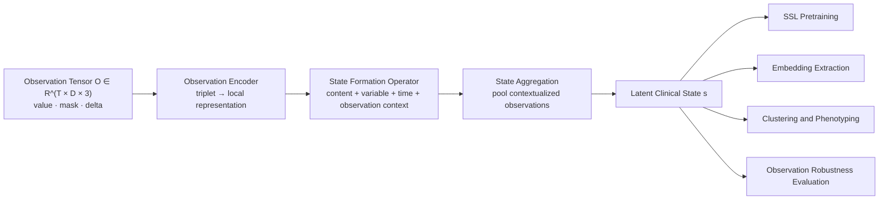

# Information State

[](https://github.com/Y-Haoran/information_state/releases)
[](LICENSE)


**State-from-Observation** is a representation-learning framework for ICU EHR that treats clinical data as an **observation tensor** rather than a flat time series. The repository is deliberately narrow: it exists to build the observation field, learn latent clinical state with self-supervision, cluster those states into candidate phenotypes, and test whether the learned representation is robust to changes in the observation process.

> Clinical state is not directly observed. It is inferred from a stream of irregular observations, each carrying different amounts of information.

## Overview

At each time step `t` and variable `d`, the model consumes an observation triplet:

```text
o(t, d) = [value, mask, delta]
```

where:

- `value` is the normalized and forward-filled measurement
- `mask` indicates whether the variable was actually observed at that time
- `delta` is the time since the last true observation

Instead of treating missingness as a nuisance after the fact, the model treats the observation process as part of the signal.



## What This Repository Contains

| Area | Purpose |
| --- | --- |
| `information_state/config.py` | Project configuration, curated feature definitions, artifact paths |
| `information_state/feature_catalog.py` | Resolution of curated variables against MIMIC-IV dictionaries |
| `information_state/observation_data.py` | Cohort construction, hourly tensor building, sliding windows, dataset classes |
| `information_state/state_from_observation.py` | Observation encoder, state formation operator, encoder model |
| `information_state/contrastive.py` | Symmetric InfoNCE objective |
| `information_state/train_ssl.py` | Self-supervised training entrypoint |
| `information_state/extract_embeddings.py` | Window-level embedding export using `model.encode()` |
| `information_state/cluster_states.py` | KMeans clustering of latent state windows |
| `information_state/evaluate_phenotypes.py` | Outcome, physiology, and transition summaries by cluster |
| `information_state/evaluate_observation_robustness.py` | Embedding drift under observation thinning |
| `tests/` | Scientific-integrity and end-to-end synthetic smoke tests |
| `notebooks/01_state_from_observation_demo.ipynb` | Data-free conceptual demo of the core mechanism |

## Design Principles

- **Observation-first**: the repo models what was measured, when it was measured, and how stale unmeasured values are.
- **Narrow scope**: no unrelated baselines, classifiers, or treatment-policy tasks are mixed into this codebase.
- **Reproducible artifacts**: each stage writes a `run_config.json` plus timestamped manifests with git and dataset provenance.
- **Stress the claim directly**: robustness to observation thinning is treated as a first-class evaluation, not an afterthought.

## Quick Start

### 1. Install

Lightweight environment:

```bash
python3 -m pip install -r requirements.txt
python3 -m pip install -e .
```

Pinned environment matching the current bounded run:

```bash
python3 -m pip install -r requirements-lock.txt
python3 -m pip install -e .
```

### 2. Run the Synthetic Smoke Test

This does not require MIMIC-IV access and is the fastest way to verify that the full pipeline works:

```bash
python3 -m unittest discover -s tests
```

### 3. Train on MIMIC-IV

```bash
python3 -m information_state.train_ssl \
  --raw-root /path/to/mimic-iv \
  --build-data \
  --window-hours 24 \
  --window-stride-hours 2 \
  --positive-window-gap-hours 2 \
  --epochs 50 \
  --batch-size 32 \
  --seed 7
```

Then run the downstream stages:

```bash
python3 -m information_state.extract_embeddings --split train val --seed 7
python3 -m information_state.cluster_states --split train --k 4 --seed 7
python3 -m information_state.evaluate_phenotypes
python3 -m information_state.evaluate_observation_robustness --split val --seed 7
```

After editable install, the same workflow is also exposed as console scripts:

- `information-state-train`
- `information-state-extract`
- `information-state-cluster`
- `information-state-evaluate`
- `information-state-robustness`

## Expected Outputs

The main artifact root is:

```text
artifacts/state_from_observation/
```

A complete run produces outputs like:

```text
artifacts/state_from_observation/
  cohort.csv
  feature_stats.json
  hourly_metadata.json
  hourly_values.npy
  hourly_masks.npy
  hourly_deltas.npy
  state_from_observation_ssl.pt
  ssl_history.json
  run_config.json
  window_metadata.csv
  manifests/
  embeddings/
  clusters/
  evaluation/
  robustness/
```

Stage-specific outputs:

| Stage | Key outputs |
| --- | --- |
| Training | `state_from_observation_ssl.pt`, `ssl_history.json`, `run_config.json` |
| Embeddings | `train_embeddings.npy`, `val_embeddings.npy`, `embedding_manifest.json` |
| Clustering | `cluster_assignments.csv`, `cluster_model.npz`, `cluster_summary.json` |
| Phenotype evaluation | `cluster_outcomes.csv`, `cluster_feature_profiles.csv`, `evaluation_report.md` |
| Robustness | `robustness_metrics.csv`, `robustness_summary.json`, `embedding_drift_histogram.png` |

## Bounded Real-Data Proof of Work

The repository currently includes a **bounded real-data smoke run** on a small MIMIC-IV subset. This is useful as a proof that the pipeline executes end to end on real source tables. It is **not** presented as final scientific evidence.

### Was the Model Trained?

Yes, but only in a bounded smoke-run setting intended to validate the full pipeline on real MIMIC-IV tables.

Current bounded training setup:

| Item | Value |
| --- | --- |
| data source | MIMIC-IV v3.1 |
| time bin | `1h` |
| window length | `24h` |
| window stride | `2h` |
| positive pair gap | `2h` |
| dynamic variables | `22` |
| delta cap | `48h` |
| model width | `d_model = 32` |
| attention heads | `4` |
| layers | `3` |
| projection dim | `32` |
| epochs | `1` |
| device | `cpu` |

### Dataset Size for the Current Trained Run

The current trained checkpoint was produced from a bounded subset with the following scale:

| Split | Stays | Subjects | Windows | Positive windows |
| --- | ---: | ---: | ---: | ---: |
| train | 11 | 11 | 397 | 386 |
| val | 2 | 2 | 29 | 27 |
| test | 3 | 3 | 24 | 21 |
| total | 16 | 16 | 450 | 434 |

Current bounded-run snapshot:

| Metric | Value |
| --- | ---: |
| stays | `16` |
| windows | `450` |
| train embeddings | `(397, 32)` |
| selected clustering | `k = 4` |
| train silhouette | `0.946` |
| train Davies-Bouldin | `0.956` |
| validation cluster stability under thinning | `1.000` |

Example cluster outcome summary from `cluster_outcomes.csv`:

| cluster | n_windows | n_stays | mortality_rate | icu_los_days_mean |
| --- | ---: | ---: | ---: | ---: |
| 0 | 375 | 11 | 0.189 | 9.292 |
| 1 | 9 | 1 | 0.000 | 15.613 |
| 2 | 7 | 1 | 0.000 | 15.613 |
| 3 | 6 | 1 | 0.000 | 15.613 |

### Multi-Metric Assessment of the Current Model

The current checkpoint should be interpreted as an **operational real-data validation model**, not a final scientific model. Even so, the repo now reports performance across several metric families rather than a single number.

#### 1. Contrastive Training Metrics

| Metric | Train | Val |
| --- | ---: | ---: |
| InfoNCE loss | `1.391` | `1.354` |
| Retrieval@1 | `0.242` | `0.259` |
| Positive cosine similarity | `0.969` | `1.000` |

#### 2. Embedding Structure Metrics

| Metric | Value |
| --- | ---: |
| clustering method | `KMeans` |
| selected `k` | `4` |
| silhouette score | `0.946` |
| Davies-Bouldin index | `0.956` |
| cluster sizes | `375, 9, 7, 6` |

#### 3. Observation Robustness Metrics

Validation windows were perturbed by randomly thinning observed measurements with drop probability `0.3`.

| Metric | Value |
| --- | ---: |
| windows evaluated | `29` |
| mean embedding drift (L2) | `2.90e-07` |
| median embedding drift (L2) | `2.90e-07` |
| mean embedding cosine | `1.000` |
| cluster stability rate | `1.000` |

#### 4. Phenotype-Level Clinical Separation

The current bounded run also produces phenotype summaries rather than only geometric embedding metrics:

- cluster-level mortality rate
- cluster-level ICU length of stay
- cluster-level mean start and end hour
- cluster-level physiology and observation-density profiles
- within-stay transition matrices between latent states

This is the current minimum multi-metric contract for the repo:

- optimization metrics from SSL training
- representation metrics from retrieval and cosine agreement
- structure metrics from clustering quality
- robustness metrics under observation thinning
- clinical summary metrics from phenotype evaluation

Generated artifact references for that bounded run:

- `artifacts/state_from_observation/embeddings/embedding_manifest.json`
- `artifacts/state_from_observation/clusters/cluster_summary.json`
- `artifacts/state_from_observation/evaluation/cluster_outcomes.csv`
- `artifacts/state_from_observation/robustness/robustness_summary.json`

## Reproducibility

Every major stage writes:

- a stage-local `run_config.json`
- a timestamped manifest under `artifacts/state_from_observation/manifests/`

Those manifests include:

- CLI arguments
- serialized project configuration
- git commit and dirty-state status
- runtime context
- dataset artifact hashes
- output artifact paths

This makes it possible to answer, for any checkpoint or downstream result:

- which code version produced it
- which observation dataset artifacts were used
- which window length, stride, and positive-pair gap were active
- which random seed and runtime settings were used

## Testing and Demo

The repo includes targeted checks for the scientific contract, not just generic unit tests.

Covered behaviors:

- observation tensor shape and binary mask semantics
- delta reset and capping logic
- positive-window gap construction
- model behavior on missing-heavy batches
- full synthetic `train → extract → cluster → evaluate → robustness` smoke run

Run validation locally:

```bash
python3 -m py_compile information_state/*.py
python3 -m unittest discover -s tests
```

For a protected-data-free walkthrough of the central idea:

- [notebooks/01_state_from_observation_demo.ipynb](notebooks/01_state_from_observation_demo.ipynb)

## What This Repo Does Not Try to Do

This repository does **not** include:

- earlier blood-culture classifiers
- broad benchmark collections unrelated to the state-formation claim
- target trial emulation
- treatment-effect modeling
- downstream tasks that would dilute the core method story

That restriction is intentional. The repository is meant to read as one coherent research software project rather than a mixed lab dump.

## Project Status

This repo is in a strong **research software** state:

- the end-to-end pipeline exists
- synthetic and bounded real-data runs are working
- the GitHub release, citation, license, and contribution metadata are in place

What still belongs to future work rather than README overclaim:

- large-scale full-corpus experiments
- final baseline comparison tables
- paper-grade figures and final statistical analysis

## Citation

If you use this repository, please cite the software metadata and the accompanying manuscript draft:

- [CITATION.cff](CITATION.cff)
- [NATURE_STYLE_MANUSCRIPT_DRAFT.md](NATURE_STYLE_MANUSCRIPT_DRAFT.md)

## Repository Metadata

- license: [LICENSE](LICENSE)
- contribution guide: [CONTRIBUTING.md](CONTRIBUTING.md)
- change history: [CHANGELOG.md](CHANGELOG.md)
- release page: <https://github.com/Y-Haoran/information_state/releases>
