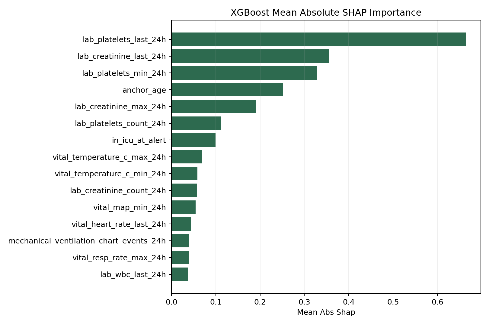

# First-Alert Gram-Positive Blood-Culture Model

## Main Question

At the time of the **first Gram-positive blood-culture alert** in a hospital admission, can we predict whether that alert is more likely:

- a **clinically significant bloodstream infection alert**
- or a **contaminant / low-significance alert**

This repo is centered on that one clean baseline task.

## Motivation And Hypothesis

The motivation is simple:

- the same Gram-positive blood-culture alert can mean a real bloodstream infection or a contaminant / low-significance signal
- that distinction matters for antibiotic escalation, microbiology review, and clinical attention

Our working hypothesis is the **physiological footprint hypothesis**:

- clinically significant alerts leave a measurable pre-alert footprint in routine clinical data
- likely contaminants do not produce the same pattern

So the main baseline asks whether we can separate those two groups using only pre-alert features such as age, acuity, recent labs, recent vitals, and prior microbiology history.

## What One Row Means

The main modeling dataset uses:

- one row = **one admission**
- specifically, the **first Gram-positive alert** in that admission

So this is **not** one row per bottle, one row per specimen, or one row per patient forever.

## Current Labels

The current label set is:

- `probable_clinically_significant_bsi_alert`
- `probable_contaminant_or_low_significance_alert`
- `indeterminate`

Only the first two groups are used for the first binary model.

Current counts:

- total first-alert rows: `5,546`
- clinically significant: `1,246`
- contaminant / low significance: `1,260`
- indeterminate: `3,040`
- high-confidence binary subset: `2,506`

## Main Baseline

The main baseline in this repo is the **clean 41-feature first-alert model**.

It uses only:

- age
- care setting / ICU support
- prior microbiology counts
- pre-alert labs
- pre-alert vitals

It does **not** use organism-family identity as a predictor.

Main files:

- clinician summary: [CLINICIAN_OVERVIEW.md](CLINICIAN_OVERVIEW.md)
- short project report: [reports/blood_culture_first_alert_project_report.md](reports/blood_culture_first_alert_project_report.md)
- stewardship slice: [reports/y0_early_antibiotic_exposure.md](reports/y0_early_antibiotic_exposure.md)
- baseline results: [BASELINE_BLOOD_CULTURE_RESULTS.md](BASELINE_BLOOD_CULTURE_RESULTS.md)
- feature reference: [BLOOD_CULTURE_FEATURE_REFERENCE.md](BLOOD_CULTURE_FEATURE_REFERENCE.md)
- explainability summary: [PRIMARY_BASELINE_EXPLAINABILITY.md](PRIMARY_BASELINE_EXPLAINABILITY.md)
- secondary `S. aureus` task: [secondary_tasks/s_aureus_first_alert/README.md](secondary_tasks/s_aureus_first_alert/README.md)
- refined same-episode `S. aureus` report: [reports/s_aureus_same_episode_first_alert_report.md](reports/s_aureus_same_episode_first_alert_report.md)
- enriched same-episode `S. aureus` report: [reports/s_aureus_same_episode_enriched_report.md](reports/s_aureus_same_episode_enriched_report.md)
- feature-reduced `S. aureus` report: [reports/s_aureus_same_episode_feature_reduction_report.md](reports/s_aureus_same_episode_feature_reduction_report.md)
- figures folder: [figures/primary_baseline](figures/primary_baseline)
- clean baseline metrics JSON: [reports/blood_culture_primary_feature_metrics.json](reports/blood_culture_primary_feature_metrics.json)
- pruned 18-feature metrics JSON: [reports/blood_culture_important_pruned_metrics.json](reports/blood_culture_important_pruned_metrics.json)

## Main Result

Held-out test performance for the clean 41-feature baseline:

- Logistic Regression: AUROC `0.798`, F1 `0.767`
- XGBoost: AUROC `0.809`, F1 `0.761`

This is the main result that should be read first.

Secondary sensitivity analysis:

- 18-feature pruned Logistic Regression: AUROC `0.791`, F1 `0.771`
- 18-feature pruned XGBoost: AUROC `0.808`, F1 `0.756`

This smaller model stayed very close to the 41-feature baseline, which is a useful robustness check.

## Biggest Findings

- the clean no-organism first-alert model still shows useful signal with AUROC around `0.80`
- the top features are mostly platelet, creatinine, age, ICU acuity, and temperature-related features
- the 18-feature pruned model stayed close to the 41-feature model, so the signal is not dependent on a very large feature table
- the project now has a clinically interpretable narrative that links label design, model performance, and feature importance

Dataset highlights:

- unique patients in the full first-alert dataset: `5,021`
- unique patients in the high-confidence binary subset: `2,369`

Main figures:

## Data Pipeline Files

Main local artifacts:

- alert-level dataset: `artifacts/blood_culture/first_gp_alert_dataset.csv`
- feature table used for training: `artifacts/blood_culture/first_gp_alert_features.csv`
- label summary: `artifacts/blood_culture/blood_culture_label_metadata.json`

Main scripts:

- cohort builder: [scripts/build_blood_culture_cohort.py](scripts/build_blood_culture_cohort.py)
- label builder: [scripts/build_blood_culture_labels.py](scripts/build_blood_culture_labels.py)
- feature builder: [scripts/build_blood_culture_features.py](scripts/build_blood_culture_features.py)
- baseline trainer: [scripts/train_blood_culture_baselines.py](scripts/train_blood_culture_baselines.py)
- pruned-feature trainer: [scripts/train_pruned_feature_baseline.py](scripts/train_pruned_feature_baseline.py)

## Supporting Files

These are still useful, but they are not the main story of the repo:

- [EDA_BLOOD_CULTURE_LABEL_VALIDITY.md](EDA_BLOOD_CULTURE_LABEL_VALIDITY.md)
- [PRIMARY_BASELINE_EXPLAINABILITY.md](PRIMARY_BASELINE_EXPLAINABILITY.md)
- `artifacts/blood_culture/blood_culture_specimen_subset.csv`
- `artifacts/blood_culture/blood_culture_specimen_subset_preview.csv`

## Practical Interpretation

The repo should now be read as:

- a **first-alert blood-culture classification project**
- with a **clean 41-feature baseline**
- and a few secondary analyses behind it

Current secondary analysis:

- refined same-episode `S. aureus` prediction from the first Gram-positive alert, with single-organism and urgent/emergency cohort cleaning
- enriched same-episode `S. aureus` model with process and prior-staphylococcal history features
- feature-reduced same-episode `S. aureus` model using SHAP-style importance and correlation pruning
